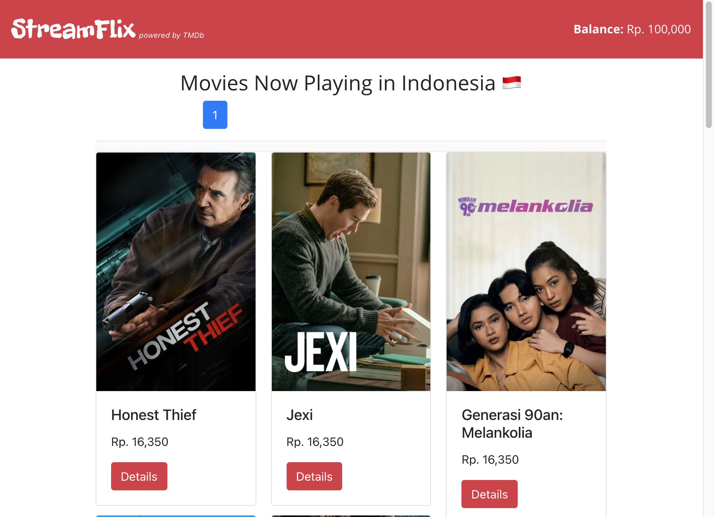

# StreamFlix Mini Project

This is a React.js app powered by the TMDb API that displays movies currently playing in Indonesia where a User has an initial balance of Rp. 100,000 and may buy any of the movies which are priced according to their average ratings.

This is my very first time learning and touching React.js as well as JavaScript testing, so do forgive some rustiness in the code as I still have plenty of room for improvement😅. Given the 3 days to complete this mini project, it was very fun and it forced me to learn a lot about React.js very quickly given the short time frame. 

This project website may be accessed at: [https://streamflix-alifyandra.netlify.app/](https://streamflix-alifyandra.netlify.app/) 

Hit me up at alifyandra@gmail.com or connect with me at https://www.linkedin.com/in/alifyandra/

Cheers! 👋